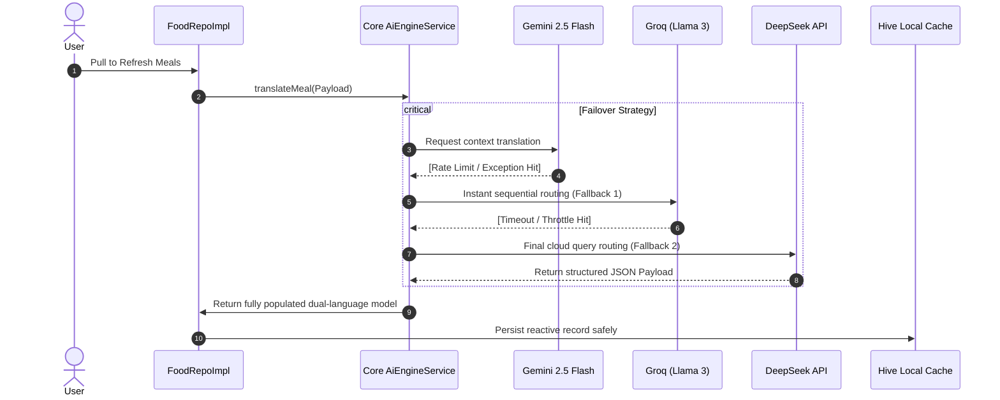

<div align="center">

# 🍏 DiaMate — Advanced Diabetic & Nutrition Companion
### State-of-the-art Flutter app empowering smarter lifestyles with real-time macro tracking, authentic Egyptian recipe adaptation, and instantaneous multi-provider AI localization.

[](https://flutter.dev)
[](https://dart.dev)
[](https://ai.google.dev/)
[](https://groq.com)
[](https://deepseek.com)
[](https://pub.dev/packages/hive)


---

| 🌙 **Dark Aesthetic** | ☀️ **Light Aesthetic** | 🇪🇬 **Adaptive Arabic UI** |
|:---:|:---:|:---:|
|  |  |  |

</div>

---

## 📑 Table of Contents
- [Core Philosophy & Vision](#-core-philosophy--vision)
- [Key Features & Superpowers](#-key-features--superpowers)
- [Enterprise Multi-Provider AI Engine](#-enterprise-multi-provider-ai-engine)
- [Smart Fallback Matrix](#-smart-fallback-matrix)
- [Authentic Diabetic-Friendly Egyptian Meals](#-authentic-diabetic-friendly-egyptian-meals)
- [System Architecture & Lifecycle](#-system-architecture--lifecycle)
- [Getting Started Locally](#-getting-started-locally)
- [Project Architecture Tree](#-project-architecture-tree)

---

## 💡 Core Philosophy & Vision

**DiaMate** is engineered from the ground up to support proactive health monitoring, catering seamlessly to diabetic lifestyles. Unlike generic health platforms, DiaMate infuses live cloud recipe databases with regional Egyptian familiarity and strict low-glycemic standards.

By utilizing a modular, decoupled **Core AI Engine Service**, the app intelligently switches between leading AI endpoints to process abstract payloads (Translations, OCR text extraction, Medical Readings) ensuring uncompromised app responsiveness and layout consistency.

---

## ✨ Key Features & Superpowers

### 🩸 Multi-Modal Glucose Display Detection
* **Direct AI Pixel Analysis:** Integrates high-precision multi-modal vision intelligence capable of parsing photographs of digital meter screens directly to extract accurate primary integer glucose readings.
* **Strict Clinical Rejection Filtering:** Employs advanced negative lookaround regex mapping coupled with explicit unit validation loops to discard background noise, non-reading numerical tokens (e.g., watermarks, IDs), and reliably reject standard non-meter random camera images.

### 🥗 Comprehensive Nutrition Monitoring
* **Intelligent Macros Dashboard:** Visually clean indicators detailing instant protein, carbohydrate, fat, and calorie progress against personalized baseline targets.
* **Camera-Assisted Food Logging:** Launch custom scanning pipelines enabling fluid automated or manual logging workflows directly into localized storage modules.

### 🇪🇬 Authentic Egyptian Focus
* **Live Network Feeds:** Direct REST queries accessing **TheMealDB API** targeting verified local Egyptian recipes modified dynamically to suggest baking, grilling, and using minimal simple carbs.
* **Smart Sentence Formatting:** Automatically parses complex un-spaced paragraphs into clean, numbered instructional steps displayed perfectly across dual language viewports.

---

## 🤖 Enterprise Multi-Provider AI Engine

DiaMate embeds a highly robust, fault-tolerant language mapping and parsing engine (`AiEngineService`) completely decoupled within the core service boundary. 

If remote translation limits intercept primary payload execution, the system gracefully cascades requests down an advanced multi-provider hierarchy before triggering localized runtime dictionaries.



---

## 🛡️ Smart Fallback Matrix

DiaMate adopts a robust degradation architecture designed to ensure zero downtime across all user-facing artificial intelligence services:

| Task Domain | Primary Provider | Tier-1 Backup | Ultimate Fallback Strategy |
|:---|:---|:---|:---|
| **Chat & Guidance** | **Gemini 2.5 Flash** | **Groq API** | Static regional behavioral prompt guides |
| **Vision Analysis** | **Gemini Vision** | **OpenRouter API** | Localized camera crop manual logging |
| **Glucose Meter OCR**| **Gemini Vision AI**| **Local ML Kit OCR** | Negative lookaround heuristics & zero-false-positive rejection |
| **Auto-Translation** | **Gemini API** | **DeepSeek / Groq** | Native substring regex matching dictionaries |
| **Nutrition Mapping**| **Edamam API** | **Gemini Core** | Static baseline localized calorie matrices |

---

## 🥘 Authentic Diabetic-Friendly Egyptian Meals

Every loaded meal automatically passes through a highly customized prompt filter dictating that recipes be optimized specifically for healthy lifestyles:
- **Low-Glycemic Replacements:** Instructions explicitly advocate replacing deep-frying with oven-roasting or grilling.
- **Natural Ingredient Tags:** Fallback parameters dynamically assign descriptive Arabic tags (`مكون طبيعي`, `زيت زيتون`, `خبز أسمر`) instantly localizing the interface even offline.

---

## 🏗️ System Architecture & Lifecycle

DiaMate implements the industry-standard **Feature-First Architecture** utilizing clean separation guidelines powered by the **Bloc/Cubit** standard.

```text
       ┌────────────────────────────────────────────────────────┐
       │                   Presentation Layer                   │
       │       (Custom Widgets, Views, ViewModels, Cubits)      │
       └───────────────────────────┬────────────────────────────┘
                                   │  Emits State / Actions
                                   ▼
       ┌────────────────────────────────────────────────────────┐
       │                      Domain Layer                      │
       │           (Abstract Repositories, Contracts)           │
       └───────────────────────────┬────────────────────────────┘
                                   │  Defines API rules
                                   ▼
       ┌────────────────────────────────────────────────────────┐
       │                      Data Layer                        │
       │  (Repo Implementations, Core AiEngineService, Hive)    │
       └────────────────────────────────────────────────────────┘
```

---

## 🚀 Getting Started Locally

### Requirements
- Flutter SDK `3.20+`
- Dart SDK `3.3+`
- Valid API keys assigned inside `lib/constant.dart` configuration structures.

### Quick Setup

```bash
# 1. Clone target code base
git clone https://github.com/AbdelmenamAdel/Diamate.git

# 2. Enter workspace root directory
cd diamate

# 3. Resolve internal library dependencies
flutter pub get

# 4. Compile layout dictionary tokens natively
flutter gen-l10n

# 5. Launch native application builds
flutter run
```

---

## 📁 Project Architecture Tree

```text
lib/
├── core/
│   ├── app/                 # Root initialization blocks & settings Cubits
│   ├── extensions/          # Clean Context-driven navigation shortcuts
│   ├── generated/           # Native asset keys mapping configurations
│   ├── language/            # App localization parsing bindings
│   ├── routes/              # Centralized navigation mapping paths
│   └── services/            # Core Decoupled AiEngineService & Singletons
│
├── features/
│   ├── food/                # Primary macro items, database integrations & Repos
│   ├── main/                # Root navigation layout shells
│   └── profile/             # Modular interactive sheets targeting settings & themes
│
└── main.dart                # Global execution layer injecting active state listeners
```

---

<div align="center">
  <p>Engineered for premium performance, flawless AI failover routing, and complete cultural immersion.</p>
</div>
