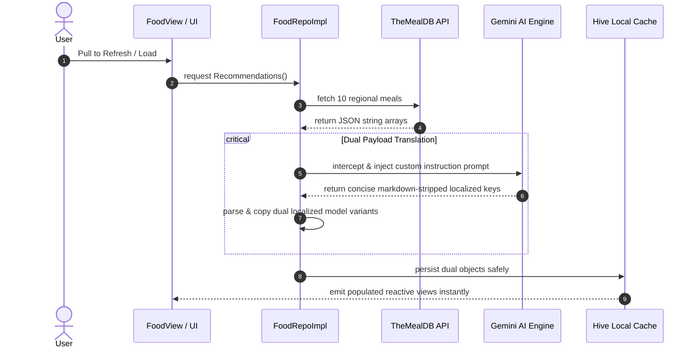

<div align="center">

# 🍏 DiaMate — Advanced Diabetic & Nutrition Companion
### State-of-the-art Flutter app empowering smarter lifestyles with real-time macro tracking, cultural recipe adaptation, and instantaneous AI localization.

[](https://flutter.dev)
[](https://dart.dev)
[](https://ai.google.dev/)
[](https://pub.dev/packages/hive)
[](https://bloclibrary.dev)


---

| 🌙 **Dark Aesthetic** | ☀️ **Light Aesthetic** | 🇪🇬 **Adaptive Arabic UI** |
|:---:|:---:|:---:|
|  |  |  |

</div>

---

## 📑 Table of Contents
- [Core Philosophy & Vision](#-core-philosophy--vision)
- [Key Features & Superpowers](#-key-features--superpowers)
- [Adaptive AI Localization Engine](#-adaptive-ai-localization-engine)
- [Premium Visual Interface (UI/UX)](#-premium-visual-interface-uiux)
- [System Architecture & Lifecycle](#-system-architecture--lifecycle)
- [Local Storage & Cache Strategy](#-local-storage--cache-strategy)
- [Getting Started Locally](#-getting-started-locally)
- [Project Architecture Tree](#-project-architecture-tree)

---

## 💡 Core Philosophy & Vision

**DiaMate** is engineered from the ground up to support proactive health monitoring, catering seamlessly to diabetic lifestyles. Unlike generic health platforms, DiaMate infuses live cloud recipe databases with regional and cultural nuances. 

By running autonomous natural language logic over remote API structures, the app intelligently renders complex nutritional structures into regional formats suitable for daily living.

---

## ✨ Key Features & Superpowers

### 🥗 Comprehensive Nutrition Monitoring
* **Intelligent Macros Dashboard:** Visually clean indicators detailing instant protein, carbohydrate, fat, and calorie progress against personalized baseline targets.
* **Camera-Assisted Food Logging:** Launch custom scanning pipelines (`FoodScannerBottomSheet`) enabling fluid automated or manual logging workflows directly into localized storage modules.

### 🌐 Culturally Bound Recipes
* **Live Network Feeds:** Direct REST queries directly accessing **TheMealDB API** delivering certified world recipes dynamically filtered for localized accessibility.
* **Regional Tagging:** Emphasizing accessibility for Middle Eastern, North African, and Mediterranean culinary preferences natively matching lifestyle familiarity.

---

## 🤖 Adaptive AI Localization Engine

DiaMate embeds a highly decoupled language mapping architecture allowing native translation triggers to instantly hydrate layout text without performance penalties.



### Key Highlights:
- **Instant Reactive Switch:** Toggling localized settings directly binds memory arrays to active UI structures (`title` vs. `titleAr`) globally via `AppCubit` streams.
- **Resilient Fallback Protection:** Network layer actively isolates formatting discrepancies. If remote translation limits intercept payload execution, the system gracefully overrides default local fallbacks ensuring non-stop operations.

---

## 🎨 Premium Visual Interface (UI/UX)

* **Glassmorphic Settings Menus:** Custom bottom sheet interactions equipped with backdrop visual filter matrices enabling premium fluid navigation controls.
* **Absolute Grid Constraints:** Custom item views heavily wrapped in protected view components (`SizedBox(height: 235)`) cleanly neutralizing underlying expanded child exception errors inside unconstrained view grids.
* **Interactive Media Carousels:** Detail headers rendered using native page controls synchronized perfectly to subtle animated sliding indicator dots.

---

## 🏗️ System Architecture & Lifecycle

DiaMate implements the industry-standard **Feature-First Architecture** utilizing clean separation guidelines powered by the **Bloc/Cubit** standard.

```text
       ┌────────────────────────────────────────────────────────┐
       │                   Presentation Layer                   │
       │       (Custom Widgets, Views, ViewModels, Cubits)      │
       └───────────────────────────┬────────────────────────────┘
                                   │  Emits State / Actions
                                   ▼
       ┌────────────────────────────────────────────────────────┐
       │                      Domain Layer                      │
       │           (Abstract Repositories, Contracts)           │
       └───────────────────────────┬────────────────────────────┘
                                   │  Defines API rules
                                   ▼
       ┌────────────────────────────────────────────────────────┐
       │                      Data Layer                        │
       │  (Repo Implementations, API Clients, Hive Data Boxes)  │
       └────────────────────────────────────────────────────────┘
```

---

## 📦 Local Storage & Cache Strategy

- **Zero-Friction Rebuilds:** Background logic actively inspects local item models. Legacy database objects detected without newer required payload mappings (`titleAr`) trigger instant dynamic network re-synchronization.
- **Synchronized Bookmarking:** Global collections map user bookmark operations synchronously against both persistent local storage boxes and active repository list caches.

---

## 🚀 Getting Started Locally

### Requirements
- Flutter SDK `3.20+`
- Dart SDK `3.3+`
- Valid API keys assigned to runtime environment arguments.

### Quick Setup

```bash
# 1. Clone target code base
git clone https://github.com/AbdelmenamAdel/Diamate.git

# 2. Enter workspace root directory
cd diamate

# 3. Resolve internal library dependencies
flutter pub get

# 4. Compile layout dictionary tokens natively
flutter gen-l10n

# 5. Launch native application builds
flutter run
```

---

## 📁 Project Architecture Tree

```text
lib/
├── core/
│   ├── app/                 # Root initialization blocks & settings Cubits
│   ├── extensions/          # Clean Context-driven navigation shortcuts
│   ├── generated/           # Native asset keys mapping configurations
│   ├── language/            # App localization parsing bindings
│   ├── routes/              # Centralized navigation mapping paths
│   └── services/            # Base singletons targeting Hive & secure storage
│
├── features/
│   ├── food/                # Primary macro items, database integrations & AI hooks
│   ├── main/                # Root navigation layout shells
│   └── profile/             # Modular interactive sheets targeting settings & themes
│
└── main.dart                # Global execution layer injecting active state listeners
```

---

<div align="center">
  <p>Engineered for maximum scale, performance, and aesthetic satisfaction.</p>
</div>
