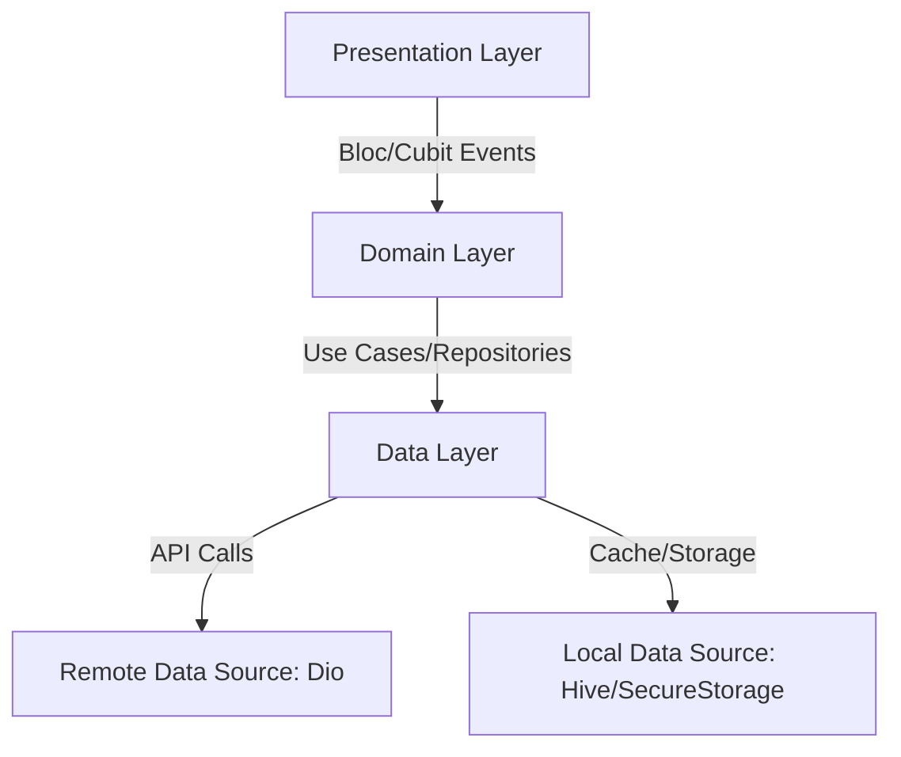

# DiaMate - Technical Audit & Project Documentation

## 1. Project Overview
DiaMate is a comprehensive healthcare Flutter application specifically designed for diabetes management and health tracking. It offers users features such as blood glucose tracking, medication logging, AI-driven food analysis, and a built-in smart chat companion to assist them in their daily health routines. 

### Mockups
<div align="center">
  
  
  
  <br/>
  
  
  
  <br/>
  
  
  
</div>

## 2. Architecture
The project adheres to Clean Architecture principles, ensuring a separation of concerns and a scalable codebase. The architecture is divided into three main layers within each feature.



## 3. Folder Structure
```text
lib/
├── core/
│   ├── app/
│   ├── database/
│   ├── extensions/
│   ├── generated/
│   ├── language/
│   ├── routes/
│   ├── services/
│   ├── styles/
│   ├── utils/
│   └── widgets/
├── features/
│   ├── auth/
│   ├── chat/
│   ├── dfu_test/
│   ├── food/
│   ├── glucose/
│   ├── lab_tests/
│   ├── main/
│   ├── medications/
│   ├── notifications/
│   ├── onboarding/
│   └── profile/
└── main.dart
```

## 4. Features
- **Authentication**: User login and registration flows.
- **Blood Glucose Tracking**: Add and monitor blood glucose readings.
- **Medication Logging**: Track medicines and schedules.
- **Food & Meal Analysis**: Vision and AI-based food detection (`vision_text_recognition`, custom food endpoints).
- **Chat Companion**: Interactive AI chat capabilities (`ai_engine_service`, `chat_companion_service`).
- **Push Notifications**: Water reminders and local greeting notifications.
- **Lab Tests Management**: Keeping track of clinical results.
- **DFU Test**: Device firmware update integration flows [NOT VERIFIED].
- **Localization**: Multi-language support (Arabic & English).
- **Theming**: Dark and Light mode support.

## 5. Dependencies
Key packages found in `pubspec.yaml`:
- **State Management**: `flutter_bloc`, `get_it`, `dartz`, `equatable`
- **Networking**: `dio`
- **Local Storage**: `hive`, `hive_flutter`, `flutter_secure_storage`
- **UI Components**: `fl_chart`, `flutter_screenutil`, `font_awesome_flutter`, `cupertino_icons`
- **Firebase**: `firebase_core`, `firebase_messaging`, `firebase_remote_config`, `cloud_firestore`
- **Media / Hardware**: `image_picker`, `video_player`, `record`, `speech_to_text`, `audioplayers`, `audio_waveforms`
- **Vision/AI**: `vision_text_recognition`
- **Utilities**: `jwt_decoder`, `intl`, `timezone`, `timeago`, `url_launcher`

## 6. API Documentation
Documented Dio endpoints via `lib/core/database/api/end_points.dart`:
- `POST Account/LogIn`: Authenticate user.
- `POST Account/RegisterNewUser`: Register a new account.
- `GET student/profile`: Fetch user profile data.
- `POST token/refresh`: Refresh authentication token.
- `POST api/v1/chat`: ChatBot interaction endpoint.
- `GET Patients/GetPatient/`: Fetch patient details.
- `POST BloodGlucoseReading/AddReadingForPatient`: Submit glucose readings.
- `POST Medicine/AddNewMedicine`: Add a new medication.
- `POST Food/AnalyzeImage`: Analyze food images.
- `POST {local-ip}:8001/detect-food`: Local machine food detection endpoint.
- `POST Meal/AddNewMeal`: Add new meal record.
- `GET Meal/GetAllMealsForPatient/{id}`: Retrieve food meals.

## 7. Database Schema
- **Hive**: Used for fast local caching and settings storage [NOT VERIFIED full schema].
- **Flutter Secure Storage**: Stores sensitive data like `accessToken`, `refreshToken`, and session keys.
- **Firebase / Firestore**: Included in dependencies likely for chat storage or push token registries [NOT VERIFIED full schema].

## 8. Authentication Flow
1. User submits credentials on the Login screen.
2. The `AuthCubit` triggers a repository method which makes a Dio call to `Account/LogIn`.
3. Upon success, the backend returns JWT tokens.
4. The `accessToken` and `refreshToken` are securely saved using `flutter_secure_storage`.
5. API Interceptors (in `lib/core/database/api/api_interceptors.dart`) attach the token to future headers.
6. The app handles 401 Unauthorized errors by automatically requesting a token refresh using the `refreshToken`.

## 9. State Management
The project uses the **BLoC (Business Logic Component)** pattern via the `flutter_bloc` package. 
- Cubits like `AppCubit`, `AuthCubit`, `FoodCubit`, and `RecommendedFoodCubit` manage state for UI modules.
- Dependency injection is heavily utilized via the `get_it` service locator (`sl`).
- State objects utilize `equatable` to efficiently compare state changes.

## 10. Error Handling
- Network requests use `dartz` to return `Either<Failure, Success>` to repositories.
- Error states are emitted by Cubits to show SnackBar notifications or error dialogs.
- Real-time internet connectivity checks are managed by `ConnectivityController`, showing a `NoInternetWidget` when offline.

## 11. Security
- Environment-specific base URLs are configured for secure testing.
- No sensitive keys are hardcoded; session and token management leverage encrypted secure storage.
- App leverages JWT tokens with explicit expiration checks (via `jwt_decoder`).

## 12. Performance
- **ScreenUtil**: Ensures responsive UI components without costly layout recalculations.
- Background services and heavy processing (like local notifications setup) are deferred to not block the main startup thread.
- Efficient state rebuilding using `BlocBuilder` to ensure only specific sub-trees are rebuilt when state changes.

## 13. Known Issues
- Currently relies on local IP addressing (127.0.0.1 / 10.0.2.2) for some backend environments, which may require adjustment for production [NOT VERIFIED].

## 14. Future Improvements
- Complete DFU implementation for external medical devices.
- Extend offline capabilities with a robust sync engine for Hive.
- Implement advanced charting metrics and predictive glucose analytics [NOT VERIFIED].

## 15. Setup Instructions
1. Ensure Flutter SDK `^3.9.2` is installed.
2. Clone the repository.
3. Run `flutter pub get` to fetch dependencies.
4. Run `dart run build_runner build --delete-conflicting-outputs` (if generating Hive adapters or Mockito tests).
5. Start the app: `flutter run`.

## 16. Environment Variables
- Setup uses explicit IP configurations (`androidIp = '10.0.2.2'`, `iphoneIp = '127.0.0.1'`).
- Expects `baseUrl` dynamically selected based on platform (`Platform.isAndroid`).
- Requires configuring a local testing backend server on port 8080 and Python/AI API on port 8001.

## 17. Deployment Guide
- Connect Firebase and download respective `google-services.json` and `GoogleService-Info.plist`.
- Update the app's `flutter_launcher_icons` and app name if required.
- Build release artifacts using `flutter build apk --release` and `flutter build ipa`.

## 18. Testing
- Testing infrastructure setup is under the `test/` directory.
- `flutter_test` SDK included.
- Test files like `test_gemini.dart` indicate AI integration testing exists. Execute using `flutter test`.

## 19. Technical Decisions
- **Clean Architecture**: Decoupled presentation, domain, and data layers to improve maintainability and scalability.
- **Dio**: Chosen over HTTP for advanced capabilities like built-in interceptors.
- **Service Locator (GetIt)**: Centralizes dependency injection, avoiding deep context passing.
- **Firebase Core/Messaging**: Standardizes push notifications and remote configurations across both mobile platforms.

## 20. Developer Onboarding
- Familiarize yourself with BLoC and Clean Architecture.
- Start at `lib/main.dart` and `lib/core/services/services_locator.dart` to understand dependency injection.
- Feature implementations can be studied independently inside `lib/features/`.
- Verify the local testing server setup to test API calls successfully.

## 21. Portfolio Summary
DiaMate is a comprehensive healthcare application built with Flutter, focused on diabetes management through AI-driven food analysis, glucose tracking, and a smart chat companion.

- Designed and implemented a robust clean architecture with Flutter and BLoC.
- Integrated AI vision for dietary tracking and speech-to-text capabilities for an interactive chat companion.
- Engineered a local-first notification ecosystem for proactive health management and water reminders.

**Technical Highlights:** Clean Architecture, BLoC State Management, Dio & Interceptors, Hive Local Storage, Firebase Cloud Messaging.

**GitHub Summary:** A meticulously structured Flutter project utilizing modern architectures and advanced libraries to deliver a seamless, state-of-the-art healthcare application experience.
