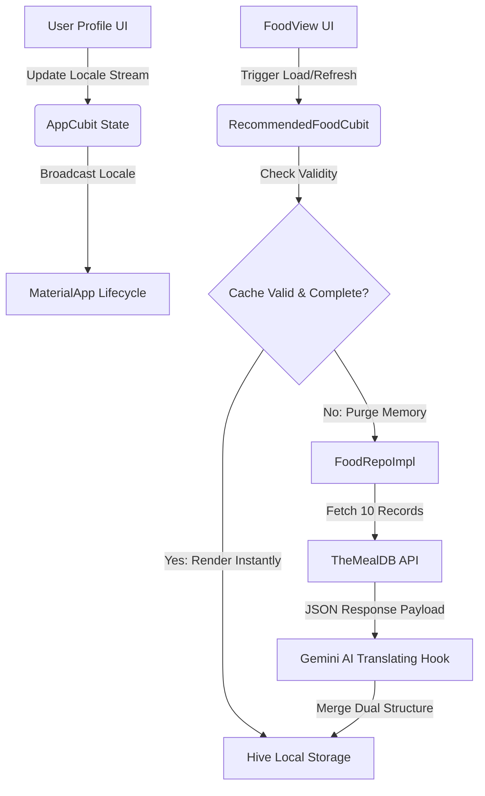

# 🍏 DiaMate — Advanced Diabetic & Nutrition Companion

<div align="center">
  
  <h3>Empowering healthier lifestyles through Real-Time Nutrition Tracking, Cultural Relevance, and AI-Powered Assistance.</h3>
</div>

---

## 🌟 Project Overview

**DiaMate** is a state-of-the-art mobile application engineered specifically for proactive diabetes management and comprehensive nutritional tracking. Built using **Flutter**, the app bridges the gap between generic diet tracking and culturally tailored health monitoring. 

By integrating rich, real-world culinary datasets with state-of-the-art **Artificial Intelligence (Gemini AI)**, DiaMate automatically translates, adapts, and localizes meal recommendations to resonate perfectly with regional tastes (focusing on Egyptian, Lebanese, and Moroccan cuisines) while seamlessly switching between adaptive native layouts.

---

## ✨ Key Highlights & Core Features

### 🍽️ 1. API-Driven Cultural Recommendations
* **Real-World Recipes:** Integrates robustly with **TheMealDB API** to deliver fresh, verified recipes complete with rich macroscopic breakdowns, exact preparation instructions, and authentic ingredient arrays.
* **Regional Targeting:** Programmatically filtered to emphasize culturally accessible diets natively suitable for localized health regimes.

### 🧠 2. Adaptive Dual-Language AI Localization Engine
* **Instantaneous UI Toggle:** Fully adaptive UI automatically maps English and Arabic configurations based on user preference or native OS locale switching—**zero hot-reloads required**.
* **Smart Gemini AI Hook:** Intercepts external database feeds and employs customized prompt engineering via the `Gemini API` to translate abstract JSON payloads into friendly, Egyptian-flavored Arabic.
* **Dual-Payload Model Architecture:** Data properties cleanly maintain parallel states (`title` vs. `titleAr`, `ingredients` vs. `ingredientsAr`) ensuring complete historical caching safety.

### 🎨 3. Premium Aesthetics & Dynamic UI/UX
* **Glassmorphic Settings:** Visually breathtaking user profile controls leveraging semi-transparent bottom sheets with custom backdrop blurs.
* **Fluid Image Carousels:** Details views embedded with responsive `PageView` controls paired with animated dot indicators.
* **Precision Grid Layouts:** Card widgets configured with rigid vertical bounding boxes (`SizedBox(height: 235)`) and flexible internal containers to completely eliminate overflow exceptions across variable aspect ratios.

### 🔒 4. Bulletproof Permissions & System Architecture
* **State-of-the-Art State Management:** Strict adherence to the **Bloc/Cubit** pattern separating view render logic from data serialization layers.
* **Robust Native Permissions:** Features a dedicated module handling real-time runtime access (`PermissionsBottomSheet`) compatible with highly restricted platform security environments (Android 13+ Media permissions, iOS Limited Status).

---

## 🏗️ System Architecture & Lifecycle Integration



---

## 📦 Persistence & Legacy Auto-Invalidation Strategy

To maintain a frictionless user journey while continuously upgrading backend structures, DiaMate incorporates a highly responsive offline caching layer powered by **Hive** and **SecureStorage**:

1. **Reactive Auto-Invalidation:** The application monitors object compliance on payload mounting. If cached legacy items lack newer required localized structures (such as `titleAr`), memory spaces are purged actively to trigger fresh API bindings.
2. **Sequential Translation Throttling:** Gemini API invocation calls execute sequentially with micro-delays (`350ms`) to securely respect free-tier provider limits, with absolute fallback fallthroughs preserving non-translated records gracefully if rate limits hit.
3. **Reactive Saved Syncing:** Bookmarked items (`saved_recommended_meals_box`) are evaluated synchronously against incoming network calls to render live favorite toggles instantaneously.

---

## 📁 Core Codebase Structure

```text
lib/
├── core/
│   ├── app/                 # Application Core Setup & Global Providers (AppCubit)
│   ├── extensions/          # Utility BuildContext extensions (context.push/pop)
│   ├── language/            # AppLocalizations implementation & JSON dictionaries
│   ├── routes/              # Global Named Routing configurations
│   └── services/            # Base hardware and persistence singletons (HiveService)
│
├── features/
│   ├── food/
│   │   ├── data/            # Models, API Service Clients, and Repository Implementations
│   │   ├── domain/          # Abstract contracts and business entities
│   │   └── presentation/    # Food View grids, Details views, and Cubit managers
│   │
│   ├── main/                # Root Dashboard, Shell views, and Quick Action items
│   └── profile/             # Settings interfaces, Language/Theme sheets, and Permissions
│
└── main.dart                # Entrypoint bootstrapping responsive themes and language streams
```

---

## 🚀 Getting Started & Local Execution

### Prerequisites
- **Flutter SDK:** Version `3.20.0` or higher.
- **Dart SDK:** Version `3.3.0` or higher.
- **API Keys:** Ensure environment configurations support local active keys for `Gemini API`.

### Installation Steps

1. **Clone the Repository:**
   ```bash
   git clone https://github.com/AbdelmenamAdel/Diamate.git
   cd diamate
   ```

2. **Fetch Packages:**
   ```bash
   flutter pub get
   ```

3. **Generate Core Assets/Locales (if missing):**
   ```bash
   flutter gen-l10n
   ```

4. **Run the Application:**
   ```bash
   flutter run
   ```

> [!TIP]
> **Testing Localized Refreshing:** To see the automated Gemini translation pipeline in action, tap the **Refresh Icon** inside the `FoodView` screen. The UI will instantly display localized Arabic fields dynamically mapping live without losing active favorites.

---

<div align="center">
  <p>Crafted with premium engineering precision for superior performance and absolute UI excellence.</p>
</div>
