<div align="center">

# 🍏 DiaMate — Advanced Diabetic & Nutrition Companion

### State-of-the-art Flutter app empowering smarter lifestyles with real-time macro tracking, authentic Egyptian recipe adaptation, and instantaneous multi-provider AI localization.

[](https://flutter.dev)
[](https://dart.dev)
[](https://ai.google.dev/)
[](https://groq.com)
[](https://deepseek.com)
[](https://pub.dev/packages/hive)

</div>

---

## 📑 Table of Contents
- [Project Overview](#1-project-overview)
- [App Mockups & UI Previews](#2-app-mockups--ui-previews)
- [Core Philosophy & Vision](#3-core-philosophy--vision)
- [Key Features & Superpowers](#4-key-features--superpowers)
- [Enterprise Multi-Provider AI Engine](#5-enterprise-multi-provider-ai-engine)
- [Smart Fallback Matrix](#6-smart-fallback-matrix)
- [Authentic Diabetic-Friendly Egyptian Meals](#7-authentic-diabetic-friendly-egyptian-meals)
- [Architecture & Folder Structure](#8-architecture--folder-structure)
- [Authentication Flow & State Management](#9-authentication-flow--state-management)
- [API Documentation](#10-api-documentation)
- [Dependencies & Technology Stack](#11-dependencies--technology-stack)
- [Database Schema & Security](#12-database-schema--security)
- [Error Handling & Performance](#13-error-handling--performance)
- [Setup Instructions & Deployment](#14-setup-instructions--deployment)
- [Portfolio & Technical Highlights](#15-portfolio--technical-highlights)

---

## 1. Project Overview
**DiaMate** is a comprehensive healthcare Flutter application specifically designed for diabetes management and health tracking. It offers users features such as blood glucose tracking, medication logging, AI-driven food analysis, authentic Egyptian recipe adaptation, and a built-in smart chat companion to assist them in their daily health routines.

---

## 2. App Mockups & UI Previews

### 🌙 Dark, ☀️ Light, and 🇪🇬 Adaptive Arabic UI
<div align="center">

| 🌙 Dark Aesthetic | ☀️ Light Aesthetic | 🇪🇬 Adaptive Arabic UI |
|:---:|:---:|:---:|
|  |  |  |

</div>

### 📱 Full Application Mockup Suite
<div align="center">
  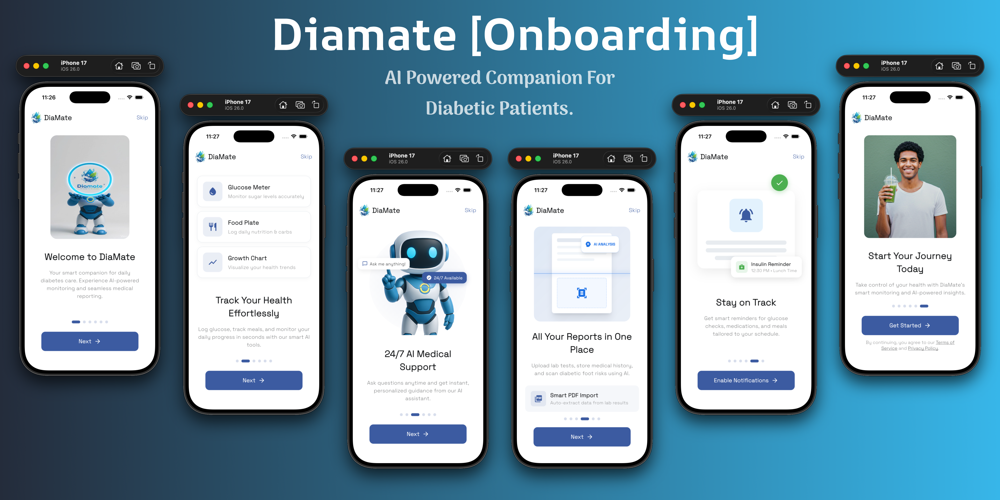
  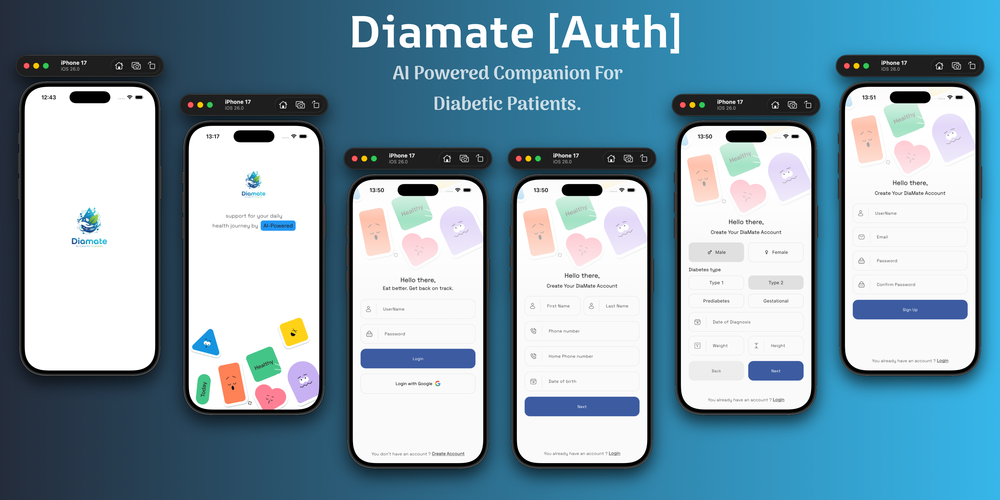
  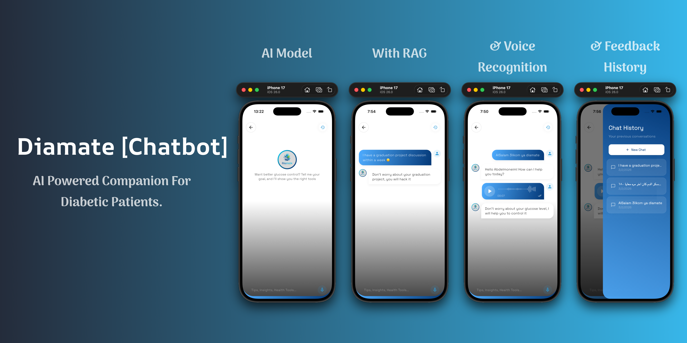
  <br/>
  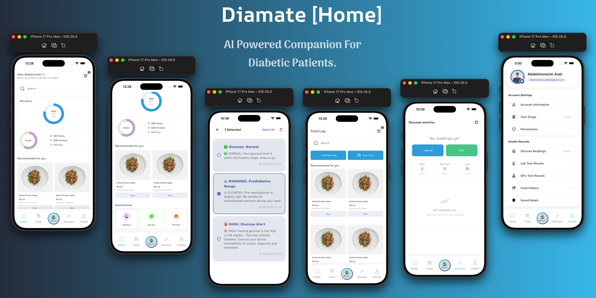
  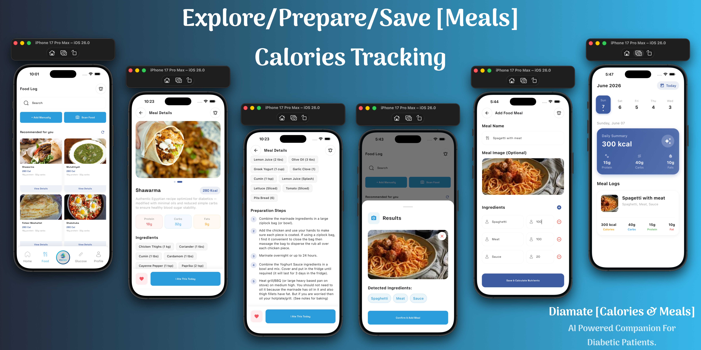
  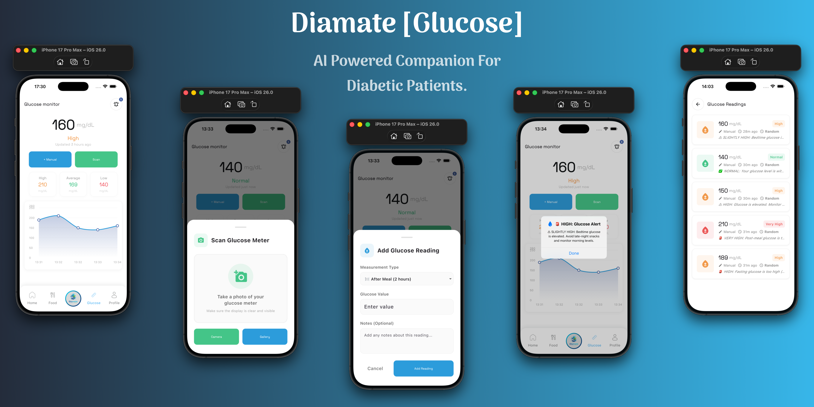
  <br/>
  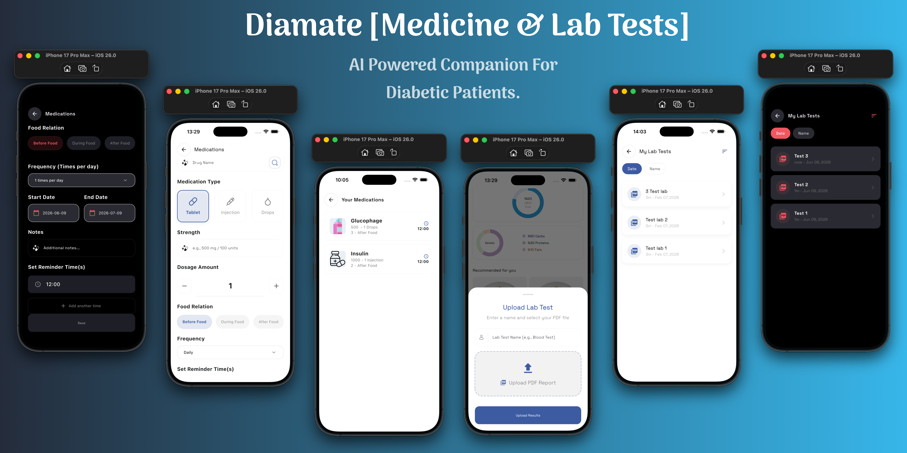
  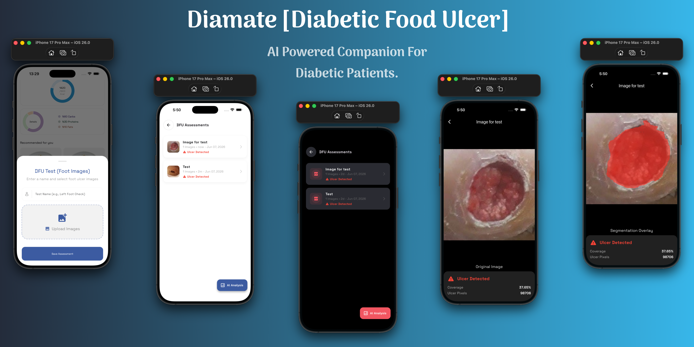
  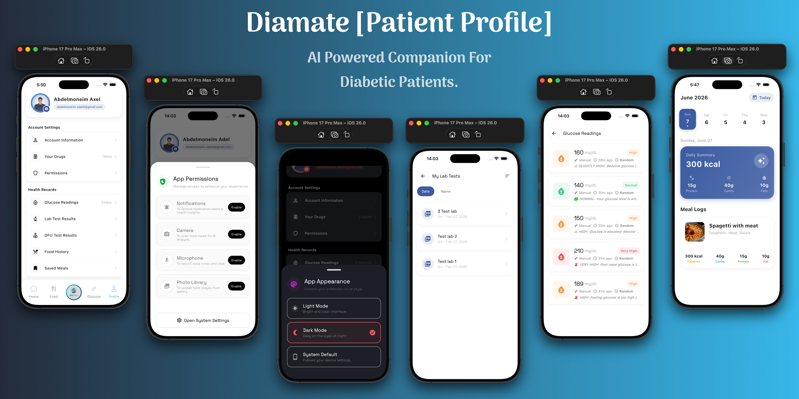
</div>

---

## 3. Core Philosophy & Vision
DiaMate is engineered from the ground up to support proactive health monitoring, catering seamlessly to diabetic lifestyles. Unlike generic health platforms, DiaMate infuses live cloud recipe databases with regional Egyptian familiarity and strict low-glycemic standards.

By utilizing a modular, decoupled **Core AI Engine Service**, the app intelligently switches between leading AI endpoints to process abstract payloads (Translations, OCR text extraction, Medical Readings) ensuring uncompromised app responsiveness and layout consistency.

---

## 4. Key Features & Superpowers

- **🩸 Multi-Modal Glucose Display Detection**:
  - *Direct AI Pixel Analysis:* Integrates high-precision multi-modal vision intelligence capable of parsing photographs of digital meter screens directly to extract accurate primary integer glucose readings.
  - *Strict Clinical Rejection Filtering:* Employs advanced negative lookaround regex mapping coupled with explicit unit validation loops to discard background noise, non-reading numerical tokens (e.g., watermarks, IDs), and reliably reject standard non-meter random camera images.

- **🥗 Comprehensive Nutrition & Food Logging**:
  - *Intelligent Macros Dashboard:* Visually clean indicators detailing instant protein, carbohydrate, fat, and calorie progress against personalized baseline targets.
  - *Camera-Assisted Food Logging:* Launch custom scanning pipelines enabling fluid automated or manual logging workflows directly into localized storage modules (`vision_text_recognition`, custom food endpoints).

- **💬 Smart Chat Companion**:
  - Interactive AI companion capabilities powered by `ai_engine_service` and `chat_companion_service`.

- **💊 Medication & Lab Tests Management**:
  - Track medicines, dosages, and schedules alongside clinical lab test results.

- **🔔 Push Notifications & Health Reminders**:
  - Water consumption reminders and local greeting notifications.

- **🇪🇬 Authentic Egyptian Focus**:
  - *Live Network Feeds:* Direct REST queries accessing **TheMealDB API** targeting verified local Egyptian recipes modified dynamically to suggest baking, grilling, and using minimal simple carbs.
  - *Smart Sentence Formatting:* Automatically parses complex un-spaced paragraphs into clean, numbered instructional steps displayed perfectly across dual language viewports.

- **🌍 Localization & Theming**:
  - Multi-language support (Arabic & English) with seamless dynamic light and dark theme switching.

---

## 5. Enterprise Multi-Provider AI Engine

DiaMate embeds a highly robust, fault-tolerant language mapping and parsing engine (`AiEngineService`) completely decoupled within the core service boundary. 

If remote translation limits intercept primary payload execution, the system gracefully cascades requests down an advanced multi-provider hierarchy before triggering localized runtime dictionaries.

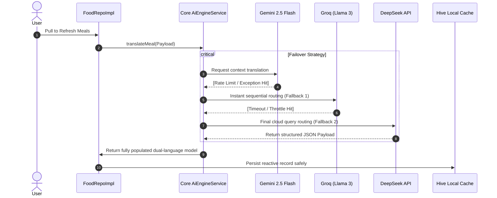

---

## 6. Smart Fallback Matrix

DiaMate adopts a robust degradation architecture designed to ensure zero downtime across all user-facing artificial intelligence services:

| Task Domain | Primary Provider | Tier-1 Backup | Ultimate Fallback Strategy |
|:---|:---|:---|:---|
| **Chat & Guidance** | **Gemini 2.5 Flash** | **Groq API** | Static regional behavioral prompt guides |
| **Vision Analysis** | **Gemini Vision** | **OpenRouter API** | Localized camera crop manual logging |
| **Glucose Meter OCR**| **Gemini Vision AI**| **Local ML Kit OCR** | Negative lookaround heuristics & zero-false-positive rejection |
| **Auto-Translation** | **Gemini API** | **DeepSeek / Groq** | Native substring regex matching dictionaries |
| **Nutrition Mapping**| **Edamam API** | **Gemini Core** | Static baseline localized calorie matrices |

---

## 7. Authentic Diabetic-Friendly Egyptian Meals

Every loaded meal automatically passes through a highly customized prompt filter dictating that recipes be optimized specifically for healthy lifestyles:
- **Low-Glycemic Replacements:** Instructions explicitly advocate replacing deep-frying with oven-roasting or grilling.
- **Natural Ingredient Tags:** Fallback parameters dynamically assign descriptive Arabic tags (`مكون طبيعي`, `زيت زيتون`, `خبز أسمر`) instantly localizing the interface even offline.

---

## 8. Architecture & Folder Structure

The project adheres strictly to **Clean Architecture** and **Feature-First** principles, ensuring a separation of concerns and scalable codebase execution.

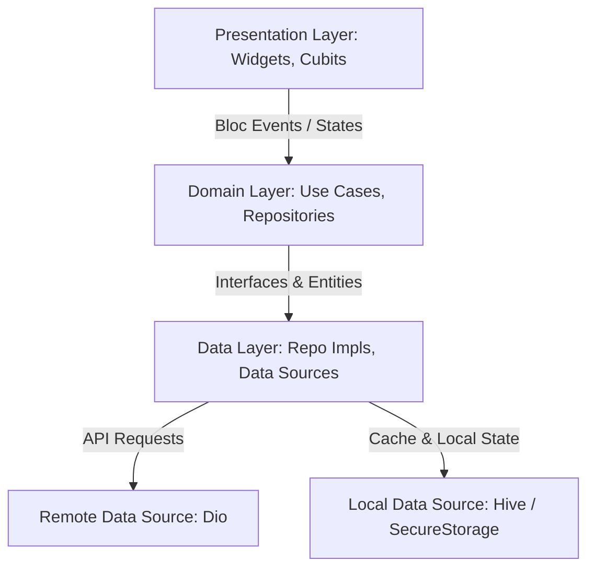

### Folder Architecture Tree
```text
lib/
├── core/
│   ├── app/                 # Root initialization blocks & settings Cubits
│   ├── database/            # API endpoints, Dio interceptors, SecureStorage
│   ├── extensions/          # Clean Context-driven navigation shortcuts
│   ├── generated/           # Native asset keys mapping configurations
│   ├── language/            # App localization parsing bindings
│   ├── routes/              # Centralized navigation mapping paths
│   ├── services/            # Core Decoupled AiEngineService & Singletons
│   ├── styles/              # Colors, themes, and design tokens
│   ├── utils/               # App constants, helpers, and formatters
│   └── widgets/             # Reusable global UI widgets
├── features/
│   ├── auth/                # Login, Register, & Authentication BLoC
│   ├── chat/                # AI Chat companion interface & Cubits
│   ├── dfu_test/            # Device firmware update testing flows
│   ├── food/                # Primary macro items, meal repositories & AI food logging
│   ├── glucose/             # Blood glucose tracking & OCR camera reader
│   ├── lab_tests/           # Patient lab results management
│   ├── main/                # Root navigation layout shells
│   ├── medications/         # Medication schedules & management
│   ├── notifications/       # Water reminders & local notifications
│   ├── onboarding/          # App onboarding screens
│   └── profile/             # Modular settings, user profile, & theme controls
└── main.dart                # Global execution layer injecting active state listeners
```

---

## 9. Authentication Flow & State Management

### BLoC State Management
The application utilizes the BLoC (Business Logic Component) pattern via `flutter_bloc`.
- Cubits like `AppCubit`, `AuthCubit`, `FoodCubit`, and `RecommendedFoodCubit` manage UI state modularly.
- Dependency injection is handled centrally using `get_it` (`sl`).
- Equatable is extended across state models for efficient UI re-renders.

### Security & Token Refresh Sequence
1. User logs in via credentials.
2. `AuthCubit` delegates API execution to the authentication repository via Dio.
3. Upon success, returned `accessToken` and `refreshToken` are stored in `flutter_secure_storage`.
4. API Interceptors (`lib/core/database/api/api_interceptors.dart`) automatically attach Bearer headers.
5. In case of 401 Unauthorized returns, the client silently attempts token refresh before failing gracefully.

---

## 10. API Documentation

Key Dio endpoints defined in `lib/core/database/api/end_points.dart`:
- `POST Account/LogIn`: Authenticate user.
- `POST Account/RegisterNewUser`: Register a new account.
- `GET student/profile`: Fetch user profile data.
- `POST token/refresh`: Refresh expired JWT token.
- `POST api/v1/chat`: AI Chat companion interaction endpoint.
- `GET Patients/GetPatient/{id}`: Fetch patient details.
- `POST BloodGlucoseReading/AddReadingForPatient`: Submit glucose readings.
- `POST Medicine/AddNewMedicine`: Add new medication.
- `POST Food/AnalyzeImage`: Analyze food images via vision AI.
- `POST {local-ip}:8001/detect-food`: Machine learning food detection endpoint.
- `POST Meal/AddNewMeal`: Add new meal record.
- `GET Meal/GetAllMealsForPatient/{id}`: Retrieve food meals list.

---

## 11. Dependencies & Technology Stack

- **State Management**: `flutter_bloc`, `get_it`, `dartz`, `equatable`
- **Networking & API**: `dio`
- **Local Storage**: `hive`, `hive_flutter`, `flutter_secure_storage`
- **UI Components**: `fl_chart`, `flutter_screenutil`, `font_awesome_flutter`, `cupertino_icons`
- **Firebase Integrations**: `firebase_core`, `firebase_messaging`, `firebase_remote_config`, `cloud_firestore`
- **Media & Hardware**: `image_picker`, `video_player`, `record`, `speech_to_text`, `audioplayers`
- **AI & Vision**: `vision_text_recognition`, Gemini AI, Groq, DeepSeek
- **Utilities**: `jwt_decoder`, `intl`, `timezone`, `timeago`, `url_launcher`

---

## 12. Database Schema & Security

- **Hive Cache**: Stores local meal caches, offline user settings, and rapid-access lists.
- **Flutter Secure Storage**: Encrypts sensitive keys (`accessToken`, `refreshToken`, device identifiers).
- **Firebase Firestore**: Used for remote push notifications & chat syncing.
- **Security Protocols**: Dynamic JWT expiration checks (`jwt_decoder`), environment-isolated base URLs, and no hardcoded production credentials.

---

## 13. Error Handling & Performance

- **Functional Error Handling**: Functional architecture using `dartz` (`Either<Failure, Success>`).
- **Network Resilience**: `ConnectivityController` intercepts connection loss, triggering `NoInternetWidget`.
- **Layout Math Optimization**: `ScreenUtil` dynamic resolution scaling without main-thread recalculation penalties.

---

## 14. Setup Instructions & Deployment

### Quick Setup

```bash
# 1. Clone target codebase
git clone https://github.com/AbdelmenamAdel/Diamate.git

# 2. Enter workspace root directory
cd diamate

# 3. Resolve internal library dependencies
flutter pub get

# 4. Run build runner for Hive & model adapters (if needed)
dart run build_runner build --delete-conflicting-outputs

# 5. Launch native application build
flutter run
```

### Environment Configuration
- Configured dynamically via `lib/core/database/api/end_points.dart` (`androidIp = '10.0.2.2'`, `iphoneIp = '127.0.0.1'`).
- Ensure local testing server runs on port 8080 and AI backend on port 8001 when running local instances.

---

## 15. Portfolio & Technical Highlights

DiaMate showcases an enterprise-grade mobile application combining healthcare precision with modern AI infrastructure:
- **Clean Architecture & BLoC**: Decoupled, testable, and maintainable codebase.
- **Multi-Provider AI Resiliency**: Automatic failover chain between Gemini, Groq, and DeepSeek.
- **Localized Cultural Adaptability**: Custom Egyptian food recipe adaptation and diabetic-friendly substitutions.

---

<div align="center">
  <p>Engineered for premium performance, flawless AI failover routing, and complete cultural immersion.</p>
</div>
